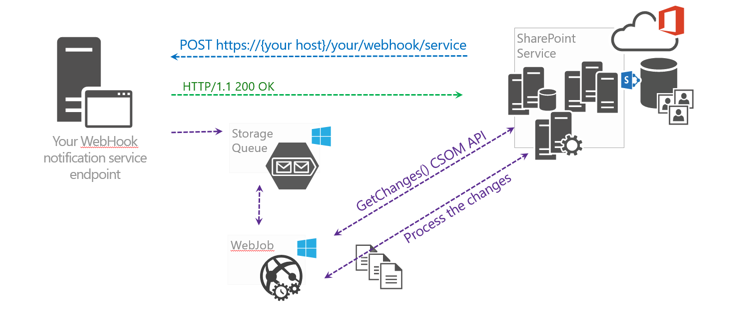

# Using Azure Functions with SharePoint Webhooks

> Note: Sample taken from [here](https://docs.microsoft.com/en-us/sharepoint/dev/apis/webhooks/sharepoint-webhooks-using-azure-functions)




## Demo

AzFunction implementation code:

```C#
#r "Newtonsoft.Json"

using System.Net;
using Microsoft.AspNetCore.Mvc;
using Microsoft.Extensions.Primitives;
using Newtonsoft.Json;

public static async Task<IActionResult> Run(HttpRequest req,
  ICollector<string> outputQueueItem, ILogger log)
{
  log.LogInformation($"Webhook was triggered!");

  // Grab the validationToken URL parameter
  string validationToken = req.Query["validationtoken"];

  // If a validation token is present, we need to respond within 5 seconds by
  // returning the given validation token. This only happens when a new
  // webhook is being added
  if (validationToken != null)
  {
    log.LogInformation($"Validation token {validationToken} received");
    return (ActionResult)new OkObjectResult(validationToken);
  }

  log.LogInformation($"SharePoint triggered our webhook...great :-)");
  var content = await new StreamReader(req.Body).ReadToEndAsync();
  log.LogInformation($"Received following payload: {content}");

  var notifications = JsonConvert.DeserializeObject<ResponseModel<NotificationModel>>(content).Value;
  log.LogInformation($"Found {notifications.Count} notifications");

  if (notifications.Count > 0)
  {
    log.LogInformation($"Processing notifications...");
    foreach(var notification in notifications)
    {
      // add message to the queue
      string message = JsonConvert.SerializeObject(notification);
      log.LogInformation($"Before adding a message to the queue. Message content: {message}");
      outputQueueItem.Add(message);
      log.LogInformation($"Message added :-)");
    }
  }

  // if we get here we assume the request was well received
  return (ActionResult)new OkObjectResult($"Added to queue");
}

// supporting classes
public class ResponseModel<T>
{
  [JsonProperty(PropertyName = "value")]
  public List<T> Value { get; set; }
}

public class NotificationModel
{
  [JsonProperty(PropertyName = "subscriptionId")]
  public string SubscriptionId { get; set; }

  [JsonProperty(PropertyName = "clientState")]
  public string ClientState { get; set; }

  [JsonProperty(PropertyName = "expirationDateTime")]
  public DateTime ExpirationDateTime { get; set; }

  [JsonProperty(PropertyName = "resource")]
  public string Resource { get; set; }

  [JsonProperty(PropertyName = "tenantId")]
  public string TenantId { get; set; }

  [JsonProperty(PropertyName = "siteUrl")]
  public string SiteUrl { get; set; }

  [JsonProperty(PropertyName = "webId")]
  public string WebId { get; set; }
}

public class SubscriptionModel
{
  [JsonProperty(NullValueHandling = NullValueHandling.Ignore)]
  public string Id { get; set; }

  [JsonProperty(PropertyName = "clientState", NullValueHandling = NullValueHandling.Ignore)]
  public string ClientState { get; set; }

  [JsonProperty(PropertyName = "expirationDateTime")]
  public DateTime ExpirationDateTime { get; set; }

  [JsonProperty(PropertyName = "notificationUrl")]
  public string NotificationUrl {get;set;}

  [JsonProperty(PropertyName = "resource", NullValueHandling = NullValueHandling.Ignore)]
  public string Resource { get; set; }
}

```

Payload for testing:

```json
{
  "value": [
    {
      "subscriptionId": "1111111111-3ef7-4917-ada1-xxxxxxxxxxxxx",
      "clientState": null,
      "expirationDateTime": "2020-06-14T16:22:51.2160000Z",
      "resource": "xxxxxx-c0ba-4063-a078-xxxxxxxxx",
      "tenantId": "4e2a1952-1ed1-4da3-85a6-xxxxxxxxxx",
      "siteUrl": "/sites/webhooktest",
      "webId": "xxxxx-3a7c-417b-964e-39f421c55d59"
    }
  ]
}
```

- Setup Webhook Subscription using `create-wh-subscription.ps1` & manipulate list.
- Watch logs or queue for change

> Note: If you want to complete this sample follow the PNP Webhook sample implementation @https://docs.microsoft.com/en-us/sharepoint/dev/apis/webhooks/webhooks-reference-implementation
